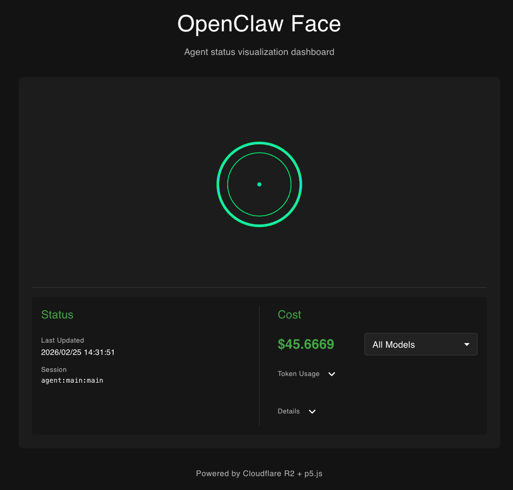
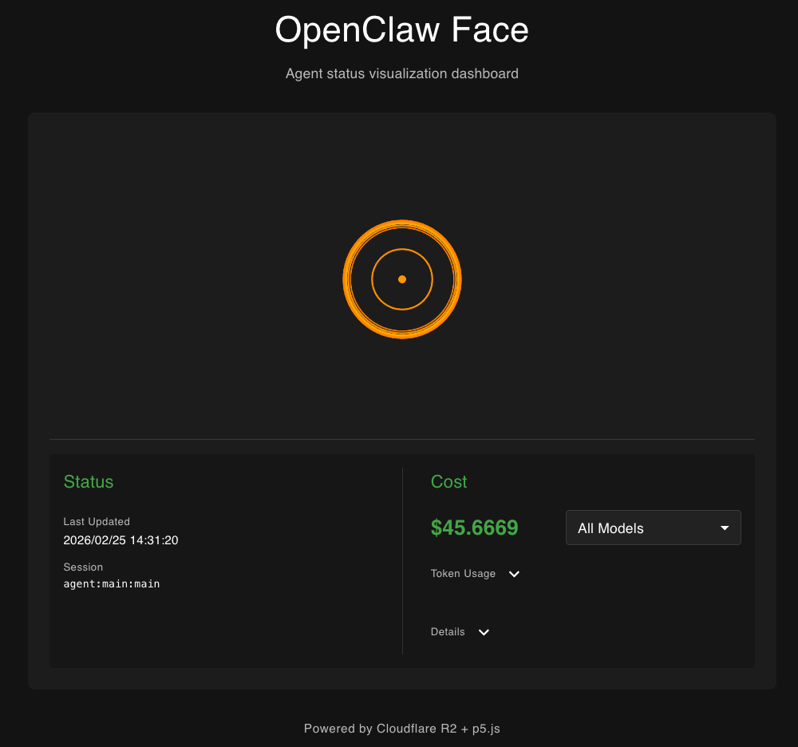

# OpenClaw Face

 

A zero-port-exposure agent status and cost visualization system using p5.js heartbeat animation. OpenClaw pushes status and cost data to Cloudflare R2, and the Face web app polls R2 to display real-time information.

## Architecture

```
┌─────────────────┐     ┌─────────────────┐     ┌─────────────────┐
│   OpenClaw      │────▶│  Cloudflare R2  │────▶│  Face Web App   │
│   (localhost)   │ PUT │  status.json    │ GET │                 │
│                 │     │  cost.json      │     │                 │
└─────────────────┘     └─────────────────┘     └─────────────────┘
```

## Prerequisites

- Node.js 20+
- pnpm
- Cloudflare R2 account (with public bucket configured)

## Installation

### 1. Install OpenClaw Hooks

Install both hooks using OpenClaw CLI:

```bash
openclaw hooks install openclaw-face-hooks
openclaw hooks install openclaw-face-cost-tracker
```

### 2. Configure R2 Bucket

Create a Cloudflare R2 bucket with public read access and CORS enabled for GET requests. Configure the bucket according to your requirements.

### 3. Set Environment Variables

Configure environment variables for the hooks:

```bash
# In hooks/openclaw-face-hooks/
cp .env.example .env

# In hooks/openclaw-face-cost-tracker/
cp .env.example .env
```

Edit each `.env` with your R2 credentials:

```env
R2_ACCESS_KEY_ID=your_access_key
R2_SECRET_ACCESS_KEY=your_secret_key
R2_ENDPOINT=https://your-account-id.r2.cloudflarestorage.com
R2_BUCKET=your-bucket-name
```

## Configuration

### R2 Bucket Setup

Configure your Cloudflare R2 bucket with:
- Public read access
- CORS enabled for GET requests from your web app origin
- API token with Object Read & Write permissions

## Testing

### Run Tests

```bash
cd hooks/openclaw-face-hooks
pnpm test:run
```

### Manual R2 Verification

Check if the status.json is accessible:

```bash
curl https://[account-id].r2.cloudflarestorage.com/[BucketName]/status.json
```

Expected response:

```json
{
  "busy": true,
  "ts": 1704067200000,
  "sessionKey": "agent:main:main",
  "source": "telegram"
}
```


```bash
curl https://[account-id].r2.cloudflarestorage.com/[BucketName]/cost.json
```

Expected response:

```json
{
  "timestamp": "2026-02-25T05:32:17.984Z",
  "sessionKey": "agent:main:telegram:group:-1003865396205",
  "totalCost": 45.66687710000001,
  "models": {
    "gemini-2.5-flash": {
      "cost": 7.382915699999999,
      "inputTokens": 21043668,
      "outputTokens": 101379,
      "cacheReadTokens": 10884904,
      "cacheWriteTokens": 0,
      "messageCount": 272
    },
    "gemini-3-flash-preview": {
      "cost": 8.546862399999998,
      "inputTokens": 15814715,
      "outputTokens": 42375,
      "cacheReadTokens": 10247598,
      "cacheWriteTokens": 0,
      "messageCount": 432
    },
    "gemini-3-pro-preview": {
      "cost": 29.737099,
      "inputTokens": 13516391,
      "outputTokens": 47698,
      "cacheReadTokens": 10659705,
      "cacheWriteTokens": 0,
      "messageCount": 172
    }
  },
  "messageCount": 902,
  "lastMessageTime": "2026-02-25T05:31:21.179Z"
}
```

## Usage

### Start OpenClaw

```bash
openclaw start
```

The hooks will automatically:
- **openclaw-face-hooks**: Push `busy: true/false` on agent state changes
- **openclaw-face-cost-tracker**: Push cost data updates

### View Dashboard

Access the Face web app at: **https://echoulen.github.io/openclaw-face/**

#### Using Custom R2 Bucket URLs

You can customize the dashboard to use your own R2 bucket by adding URL parameters:

```
https://echoulen.github.io/openclaw-face/?status=YOUR_STATUS_URL&cost=YOUR_COST_URL
```

**Example:**
```
https://echoulen.github.io/openclaw-face/?status=https://pub-dcbb32a3717b46e4b741f6a1ff236e83.r2.dev/status.json&cost=https://pub-dcbb32a3717b46e4b741f6a1ff236e83.r2.dev/cost.json
```

**Parameters:**
- `status`: URL to your `status.json` file
- `cost`: URL to your `cost.json` file

**Notes:**
- If no parameters are provided, the dashboard uses default configuration
- Both parameters are optional - you can specify just one if needed
- URLs must be publicly accessible (no authentication required)

You should see:
- **Green sine wave**: Agent is idle
- **Red pulsing animation**: Agent is busy
- **Gray wave**: Connection lost
- **Cost display**: Real-time cost tracking with model breakdown

## Troubleshooting

### Hook Not Pushing

1. Check environment variables are set:
   ```bash
   echo $R2_ACCESS_KEY_ID
   echo $R2_SECRET_ACCESS_KEY
   echo $R2_ENDPOINT
   echo $R2_BUCKET
   ```

2. Verify R2 credentials have write permission

3. Check OpenClaw logs for hook errors

### Dashboard Not Updating

1. Verify R2 bucket is publicly readable
2. Check browser console for CORS errors
3. Verify the URLs in `face/.env` are correct
4. **For custom URLs**: Test your URLs directly:
   ```bash
   curl "YOUR_STATUS_URL"
   curl "YOUR_COST_URL"
   ```
5. **For custom URLs**: Ensure URLs are properly URL-encoded if they contain special characters

## File Structure

```
openclaw-face/
├── README.md
├── face/                              # React + p5.js web app
│   ├── .env.example                   # Web app environment variables
│   ├── src/
│   │   ├── components/                # React components
│   │   ├── hooks/                     # Custom React hooks
│   │   └── sketches/                  # p5.js animation sketches
│   └── package.json
└── hooks/
    ├── openclaw-face-hooks/           # Status tracking hook
    │   ├── .env.example
    │   ├── HOOK.md
    │   └── handler.ts
    └── openclaw-face-cost-tracker/    # Cost tracking hook
        ├── .env.example
        ├── HOOK.md
        └── handler.ts
```

## Security

- **Zero Port Exposure**: OpenClaw only runs on localhost
- **Read-Only Dashboard**: Face web app only reads from R2
- **No Credentials in Frontend**: Dashboard uses public R2 URLs only
- **Minimal Permissions**: Hooks only need PutObject permissions

## License

MIT